# spring-cloud-gcp
Guestbook app with Spring as backend, Thyme leaf for frontend, Cloud SQL for DB, Cloud Trace for reports.

## sql 1 :
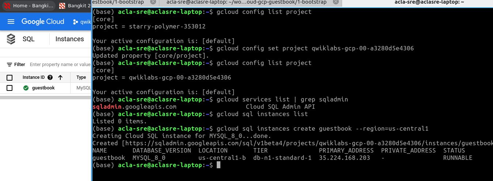
## sql 2 :
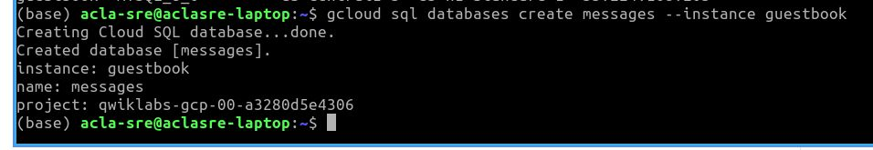
## sql 3 :

## sql 4 :
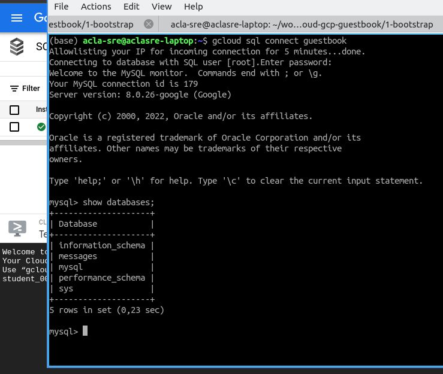
## sql 5 :

## sql 6 :
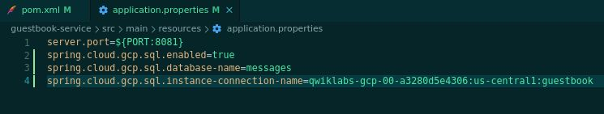
## sql 7 :
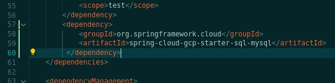
## sql 8 :
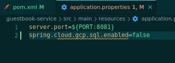
## sql 9 :
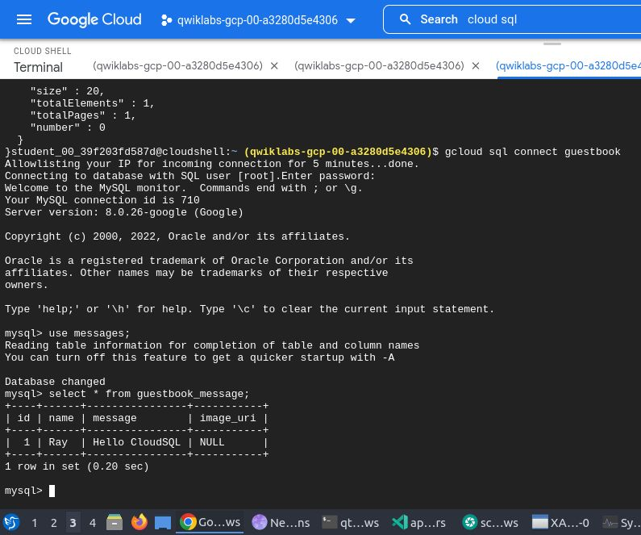
## sql 10 :
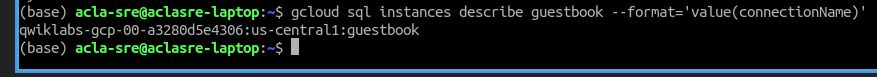
## sql 11 :
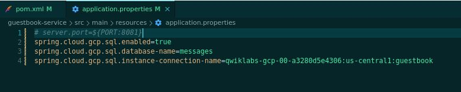
## trace 1 :
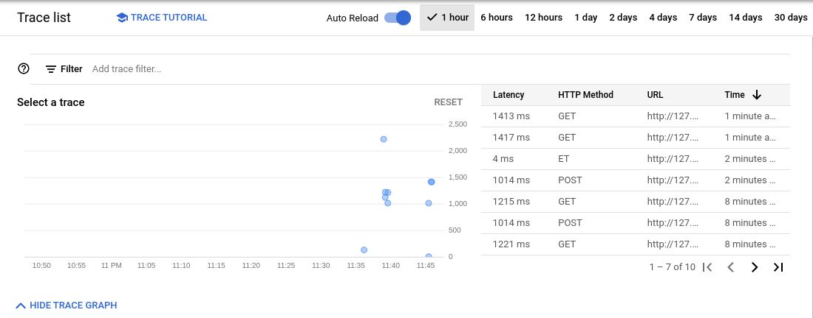
## trace 2 :
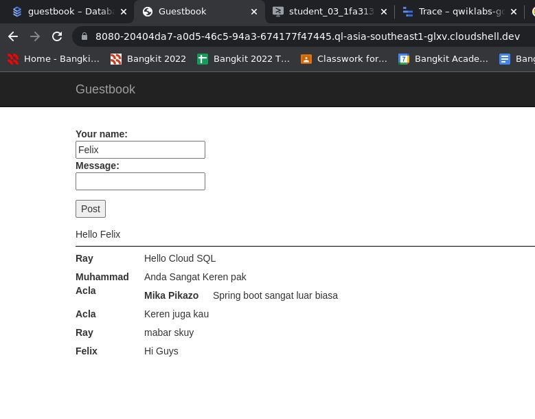
## trace 3 :
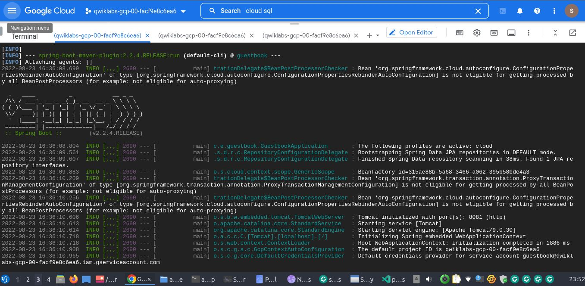

